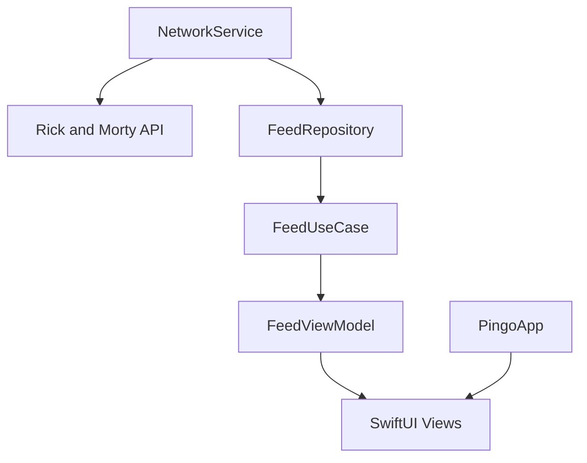
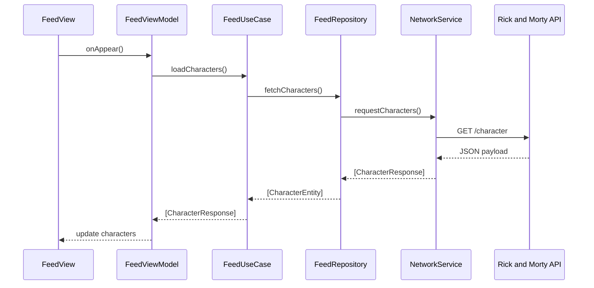
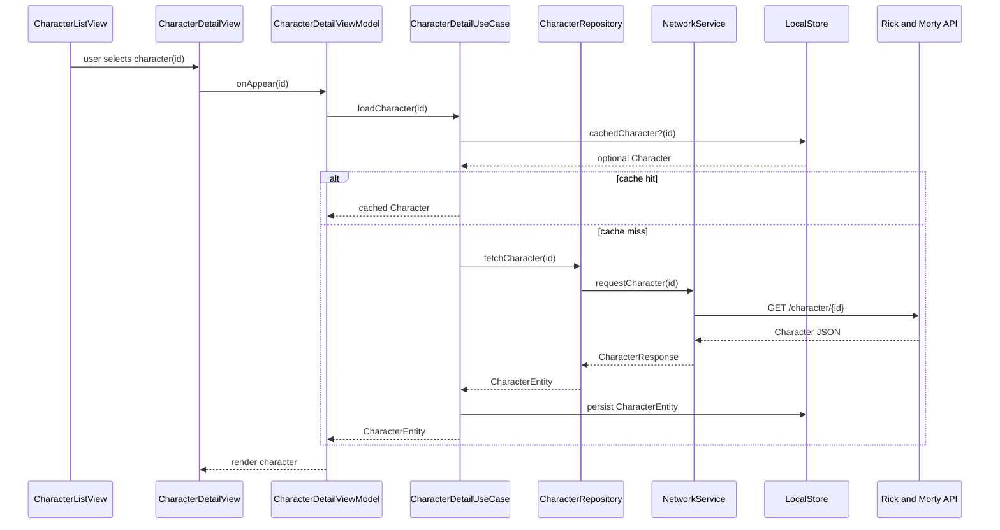
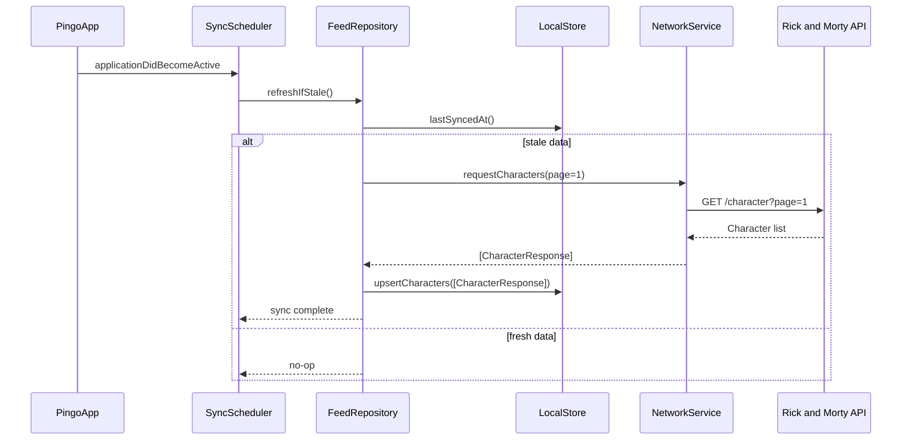

# Pingo

 

> Replace the placeholder CI badge with your workflow status once configured.

Pingo is a SwiftUI application that showcases a Clean Architecture approach for consuming the Rick and Morty API. The project highlights separation between networking, repositories, use cases, and presentation layers.

## Getting Started
- Open the project with `open Pingo.xcodeproj` to explore or run the app in Xcode.
- Run `xcodebuild -scheme Pingo -configuration Debug build` to verify the command-line build.

## Environment Setup
- Requires Xcode 15+ with Swift 5.9 toolchain; confirm via `xcodebuild -version`.
- Use the iOS 17 simulator (e.g., iPhone 15) to mirror CI runs called out in `xcodebuild test`.
- No API key is needed; the project targets the public Rick and Morty API, so ensure the simulator has network access for live data.
- Review the [Rick and Morty API docs](https://rickandmortyapi.com/documentation) for model schemas and query parameters when extending data access.

## Architecture Overview
- Core layers follow Clean Architecture: networking feeds repositories, repositories wrap use cases, and SwiftUI views react via observable view models.
- The diagram below outlines the primary data flow and dependency direction.

### Key Flow: Feed Refresh

### Key Flow: Character Detail

### Key Flow: Offline Cache Sync

## Feature Roadmap
- **Episode Browser**: Expose an `EpisodeRepository` and SwiftUI list to explore episodes with pagination.
- **Character Detail**: Extend `FeedUseCase` to fetch rich character data, with a dedicated detail view sharing the view model through dependency injection.
- **Offline Cache**: Introduce persistence via Core Data or SQLite, abstracted behind repository protocols to keep use cases storage-agnostic.

## Contributor Guide
For detailed contribution standards, including structure, style, and testing expectations, see [Repository Guidelines](AGENTS.md).

## Continuous Integration
- Plan to publish CI status via a GitHub Actions workflow badge, for example ``.
- Ensure the workflow runs `xcodebuild -scheme Pingo build` and `xcodebuild test -scheme Pingo -destination 'platform=iOS Simulator,name=iPhone 15'` to mirror local verification.
